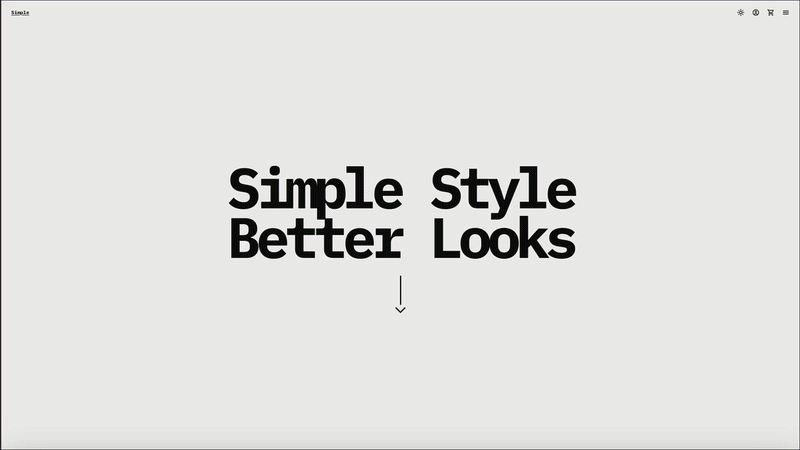

## Demo
This is currently a frontend demo only.

Resolution and smoothnes are a lot better it is just a bad video conversion.




### Demonstrable Features
- Responsive fixed navigation with a mobile menu
- Theme toggle with inverted light/dark-style palettes
- Hero section with animated scroll cue
- Data-driven product catalog generated from product image assets
- Product grid with category copy and live product counts
- Filtering by category, color, and size
- Sorting by relevance, newest, price, discount, and alphabetical options
- Product detail modal with add to cart btn materials info shipping info size and color selectors
- Cart modal with quantity controls, subtotal calculation, and item removal
- Toast notification when a product is added to cart
- About, Contact, Login, Register, and Reset Password modal screens
- Keyboard and overlay handling, including `Escape` to close open panels

## NOTE
- Login, registration, password reset, promo code, and checkout are present as UI flows
- Product and cart state are stored in React state only
- No API, database, authentication provider, or payment integration is connected

### Responsiveness
- Navigation spacing tightens on smaller screens and the menu expands into a mobile dropdown
- The product grid scales from 4 columns to 3, then 2, then 1 column
- Hero typography uses `clamp()` to stay readable across desktop and mobile sizes
- Sticky catalog controls adjust when the navigation hides on scroll
- Section padding and spacing are reduced for tablet and mobile breakpoints
- Modal and overlay interactions are designed to work across desktop and smaller viewports

## Technologies Used
- React
- Vite
- JavaScript (ES modules)
- CSS
- ESLint

## Project Structure
```text
public
├─ favl
├─ icons
└─ imgs
src
├─ components
│  ├─ Footer
│  │  ├─ footer.css
│  │  └─ Footer.jsx
│  ├─ Global
│  │  └─ Global.jsx
│  ├─ Hero
│  │  ├─ hero.css
│  │  └─ Hero.jsx
│  ├─ Modals
│  │  ├─ About
│  │  ├─ Cart
│  │  ├─ Contact
│  │  ├─ Filter
│  │  ├─ Profile
│  │  ├─ Sort
│  │  ├─ View
│  │  └─ ModalShell.jsx
│  ├─ Nav
│  │  ├─ nav.css
│  │  └─ Nav.jsx
│  └─ Products
│     ├─ ProductRating.jsx
│     ├─ products.css
│     └─ Products.jsx
├─ data
│  └─ products.js
├─ App.jsx
├─ index.css
└─ main.jsx
.gitignore
eslint.config.js
index.html
package-lock.json
package.json
README.md
vite.config.js
```

## Running the Project

```bash
npm install
npm run dev
```
## How was the page builded
- Made a reaserch on famous clothing brands looked at their style and logic flow
- Started building a vanila one page demo with html js css only to get an idea how I want the page to look like.
- Implemented and adjusted the following assets to the vanila demo:
- 1 ) https://uiverse.io/WhiteNervosa/popular-ladybug-27
- 2 ) https://uiverse.io/Satwinder04/pink-bat-77 Contact,Regitser,Login input style idea came from here
- 3 ) Cant find the patern used for the background of the product view modal but it was also taken from universe.io
- 4 ) https://codepen.io/jltk/pen/QEaxMx - The Pulsating Arrow idea came from here
- 5 ) https://fonts.google.com/icons - All icons and font styles trough the page are from here
- Used AI for product img generation product.js logic and help with some of the style adjustments
- Used GIMP for transperancy of the images because the AI was unable to crop them well
- After deciding the overal style and layout on the demo I choped everything to components some reusable some not
- While choping everything in components I looked for dead unused or repeated code
- Deleted a lot of unused and repeated code then ran a scan using AI to look also for dead and unused code
- Did a react vanila sort of merging between rendering components with react but still hiting the dom vanila style
- After I aligned everything and everything looked as I wanted I needed help with the react logic since this the second time I use React and used AI to help me with the Logic.
- Went trough the whole project a couple of times too look for dead unused code again and ran a couple of smoke tests for filters sorting btns display rendering different browser rendering etc.
- Made the Readme.md used AI to clear all typos and fill some random product info on all products.
- 
## Chalanges during development
- The first chalange I have encountered was the Big Text Parallax animation up until now I have done only IMG based paralax not pure CSS only Paralax so the alignemnt of the text and the indexing of the different sections and making sure that the text is with position fixed but never seen below the product page
- Solution : Relatively easy looked at a couple of examples in https://www.w3schools.com
- Second and biggest chalange ware the filters and product rendering since the logic changed a lot between the vanila demo and the react.
- Solution : Asked AI to make a couple of single page demos with only a filter to look at the logic and try it myself took like 3 to 5 demos to get it right then transfered it to the main React page and it broke compleatly :D 
- Looked at the logs errors in dev tools again ran demos a bit coding from my side a bit help from AI and a bit of stolen code and now we have it.
- Third chalange was the sticky filter plus the fixed navbar that hides on scroll down and reveals on scroll up
- Solution : Went trough a couple of examples in https://www.w3schools.com implamented the solution but there ware size differences and some transform delays between the add to cart reveal on scroll hide and reveal used AI to help me make it more synhronized.

